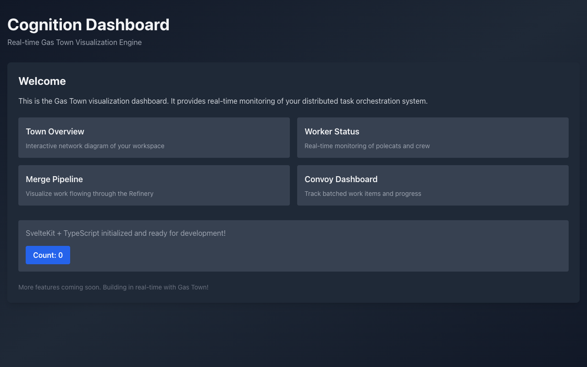

# Cognition Dashboard

**Real-time Gas Town Visualization Engine**

A modern, interactive web dashboard for monitoring and visualizing Gas Town operations. Watch polecats work, see the merge pipeline, track convoys, and understand your distributed task orchestration system at a glance.

## Features

### Core Visualization

- **Town Overview** - Interactive network diagram of your Gas Town workspace
- **Worker Status** - Real-time monitoring of polecats and crew members
- **Merge Pipeline** - Visualize work flowing through the Refinery queue
- **Convoy Dashboard** - Track batched work items and their progress
- **Escalation Tree** - Monitor what issues need attention
- **Mail/Messages** - See inter-agent communication in real-time

### Monitoring

- ✨ Real-time updates via WebSocket
- 📊 Historical activity timeline
- 🎯 Work item details and status
- 🔄 Refinery merge queue visualization
- 📈 Performance metrics and throughput stats
- 🚨 Escalation alerts and incident tracking

### Architecture

- **Frontend**: Svelte 4 + TypeScript + Vite
- **Visualization**: Cytoscape.js for network graphs
- **Real-time**: WebSocket + Server-Sent Events
- **Styling**: Tailwind CSS

## Getting Started

### Prerequisites

- Node.js 18+
- Gas Town installation (`gt`)
- GitHub CLI (`gh`)

### Installation

```bash
npm install
npm run dev
```

Visit `http://localhost:5173` to see the dashboard.

## Project Structure

```
src/
├── routes/              # SvelteKit routes
│   ├── +page.svelte    # Main dashboard
│   └── api/            # API endpoints for Gas Town
├── lib/
│   ├── components/     # Reusable Svelte components
│   ├── stores/         # State management
│   ├── gas-town.ts     # Gas Town integration
│   └── visualizer.ts   # Cytoscape visualization
└── styles/             # Global styles
```

## Gas Town Integration

The dashboard reads live data from your Gas Town installation:

- Polecats and their worktree status
- Beads (work items) and their progress
- Witness monitoring data
- Refinery merge queue
- Escalation events
- Mail messages

```typescript
// Example: Query Gas Town state
import { queryGasTown } from "$lib/gas-town";

const polecats = await queryGasTown.polecats();
const mergeQueue = await queryGasTown.refinery.queue();
const escalations = await queryGasTown.escalations();
```

## Development

### Build

```bash
npm run build
```

### Test

```bash
npm test
```

### Lint

```bash
npm run lint
```

## Validation

The dashboard has been tested and verified working as of 2026-01-03.

### Screenshot



The dashboard displays:
- **Header**: "Cognition Dashboard" with subtitle "Real-time Gas Town Visualization Engine"
- **Welcome Section**: Introduction to the dashboard purpose
- **Feature Cards**: Four main visualization areas (Town Overview, Worker Status, Merge Pipeline, Convoy Dashboard)
- **Interactive Elements**: Counter button demonstrating Svelte reactivity
- **Styling**: Dark theme with Tailwind CSS gradient background

### Build Results

```
vite v5.4.21 building for production...
✓ 29 modules transformed
dist/index.html                  0.43 kB │ gzip: 0.29 kB
dist/assets/index-ClZ3EHJe.css  12.35 kB │ gzip: 3.29 kB
dist/assets/index-mc7ym1t0.js    6.51 kB │ gzip: 2.93 kB
✓ built in 270ms
```

### Test Results

| Check | Status | Notes |
|-------|--------|-------|
| Build (`vite build`) | ✅ Pass | Production build succeeds |
| Dev Server (`vite`) | ✅ Pass | Runs on http://localhost:5173 |
| ESLint (`npm run lint`) | ✅ Pass | No linting errors |
| TypeScript (`npm run check`) | ⚠️ 3 errors | Interface declarations in component files need refactoring |

**Known Issues:**
- 3 TypeScript errors in `src/lib/components/` - `export interface` declarations should be moved to `<script context="module">` or separate `.ts` files
- 1 warning about unused export in CytoscapeViewer.svelte

### Tech Stack Verified

- Svelte 4.2.8
- Vite 5.4.21
- TypeScript 5.3.3
- Tailwind CSS 3.4.1

## Features Roadmap

- [ ] Interactive polecat lifecycle visualization
- [ ] Molecule step-by-step progress tracking
- [ ] Real-time merge queue animation
- [ ] Escalation drill-down details
- [ ] Performance timeline graph
- [ ] Custom alert thresholds
- [ ] Export/report generation
- [ ] Multi-town support

## License

MIT

## Built with Gas Town

This dashboard is built using Gas Town itself. Watch polecats work on these features in real-time!
